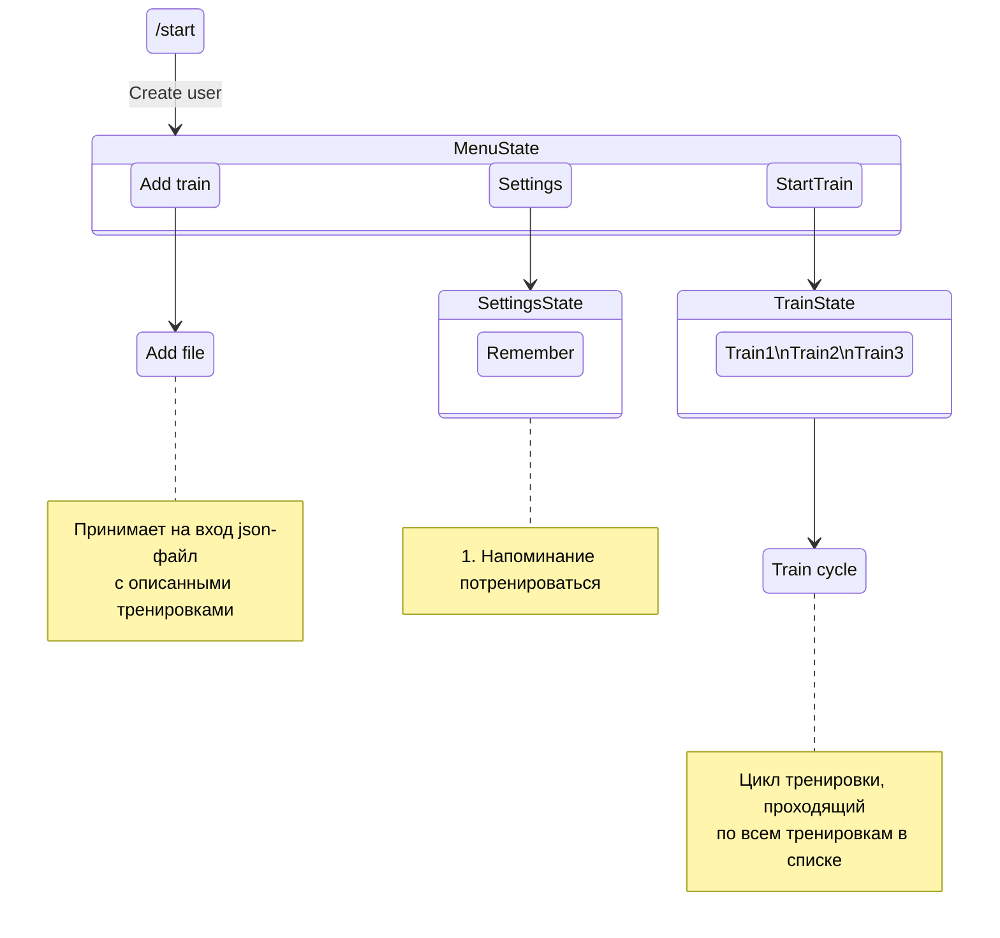

```mermaid
stateDiagram-v2
    %% Переменные
    AddTrain: Add train
    SendFile: Add file
    TrainList: Train1\nTrain2\nTrain3
    TrainCycle: Train cycle

    %% Основной граф
    /start --> MenuState: Create user
    state MenuState {
        StartTrain
        AddTrain
        Settings
    }

    StartTrain --> TrainState
    Settings --> SettingsState
    AddTrain --> SendFile

    state TrainState {
        TrainList
    }
    TrainState --> TrainCycle

    state SettingsState {
        Remember
    }

    %% Заметки
    Note right of TrainCycle
        Цикл тренировки, проходящий
        по всем тренировкам в списке
    end note

    Note right of SendFile
        Принимает на вход json-файл
        с описанными тренировками
    end note

    Note right of SettingsState
        1. Напоминание потренироваться
    end note
```